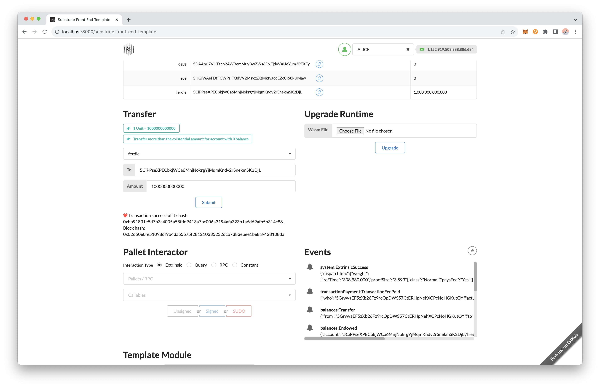

# Building a blockchain
In this first hands on project we will start a local blockchain node and then interact with it.

## Substrate node

There is a compiled template node already included in this directory. To launch it we need to run the following command

```bash
./node-template --dev
```

The terminal should display something like this:


## Front-end template

Make sure `yarn` and `node` are installed on your local computer. Go to the front-end directory, install dependencies needed followed by starting the app itself. The app is running on the http://localhost:8080

## Interacting with Blockchain: Transfer funds from an account

For the on-chain operation, let's try to transfer funds from Alice to Ferdie. 
1. Make sure **Alice**'s account is selected in the top right corner.
2. Go to Transfer section, select **Ferdie** as the recipient
3. For the amount we'll enter **1000000000000** (10<sup>12</sup>)
4. Notice the values in Balance table is updated accordingly

