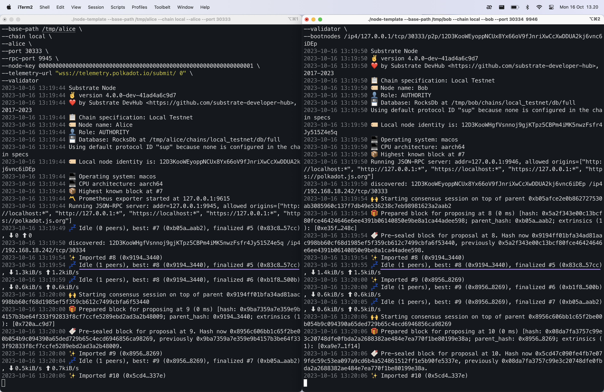

# Simulating a Substrate Network
In this second hands on project we will simulate a substrate network by adding multiple nodes to the network and see how they interact. There is an already compiled node included in this directory.

## Starting the first node

We'll use **Alice** account as the the first node. Before that ensure the chain data is in clean state.

```bash
./node-template purge-chain --base-path /tmp/alice --chain local -y
```

Then start the first node by running

```bash
./node-template \
--base-path /tmp/alice \
--chain local \
--alice \
--port 30333 \
--rpc-port 9945 \
--node-key 0000000000000000000000000000000000000000000000000000000000000001 \
--telemetry-url "wss://telemetry.polkadot.io/submit/ 0" \
--validator
```

The terminal should display something like this:


The last line indicates there are no other nodes in the network and no blocks are being produced.

## Adding the second node

For the second node, we'll use the **Bob** account and add it in to the network. Just like before starting the first node, make sure the old chain data is purged.

```bash
./node-template purge-chain --base-path /tmp/bob --chain local -y
```

Then start the second node by running

```bash
./node-template \
--base-path /tmp/bob \
--chain local \
--bob \
--port 30334 \
--rpc-port 9946 \
--telemetry-url "wss://telemetry.polkadot.io/submit/ 0" \
--validator \
--bootnodes /ip4/127.0.0.1/tcp/30333/p2p/12D3KooWEyoppNCUx8Yx66oV9fJnriXwCcXwDDUA2kj6vnc6iDEp
```

## Verify blocks production

Once both nodes are running, the nodes should connect to each other as peers and start producing blocks.
<p><span style='background-color:#33CCFF; color:black'>The first node identity was discovered on the network.</span> <span style='background-color:#FF66FF; color:black'>And the second node identity was discovered on the network as well.</span></p>


The node has one peer. The nodes have produced some blocks, and blocks are being finalized.



Let's shut down the second node. We can see that the remaining node now has zero peers and stopped producing blocks

