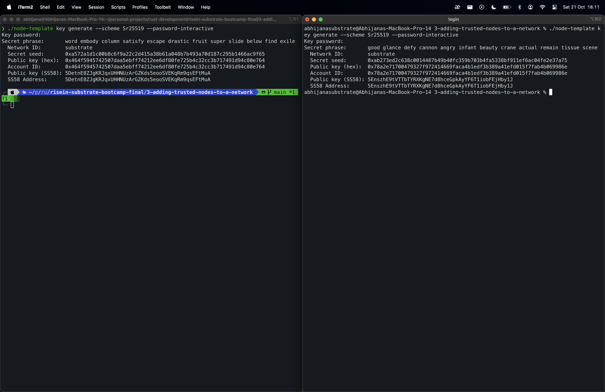
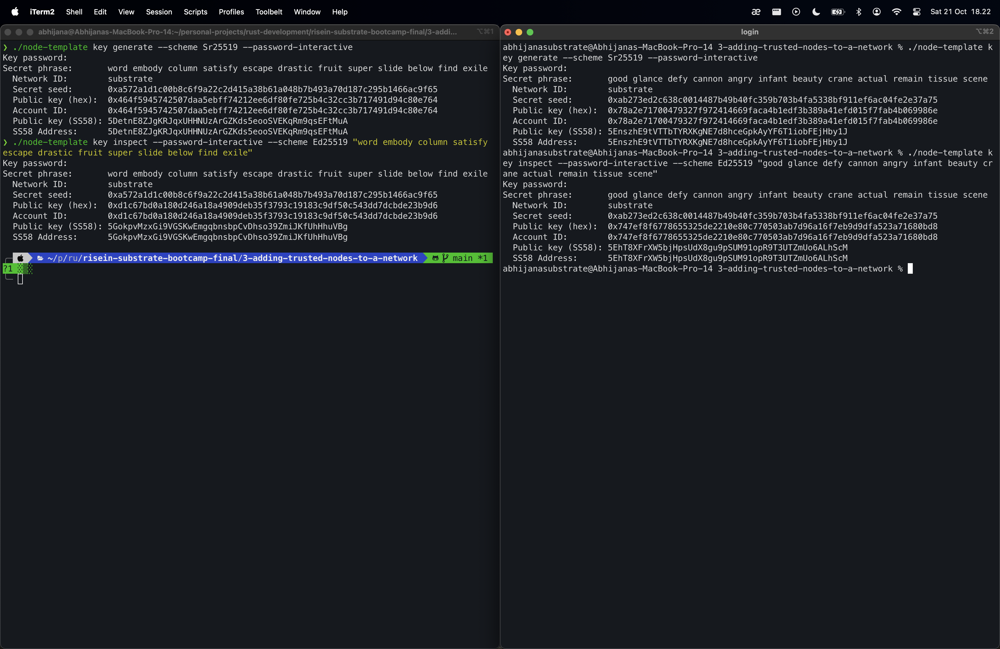
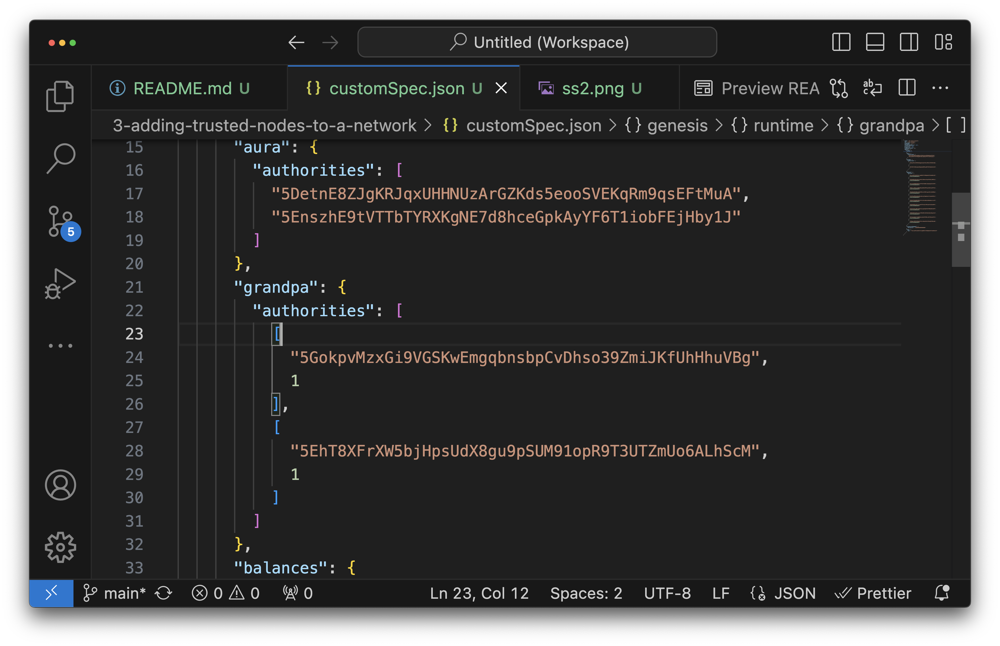
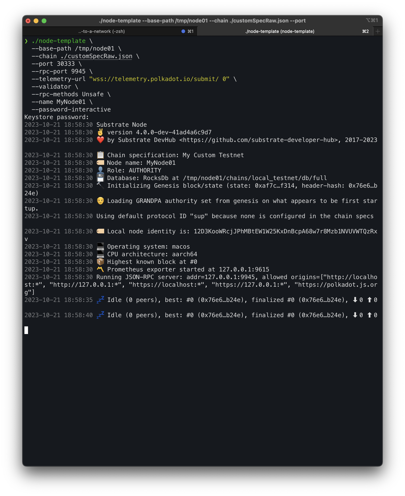
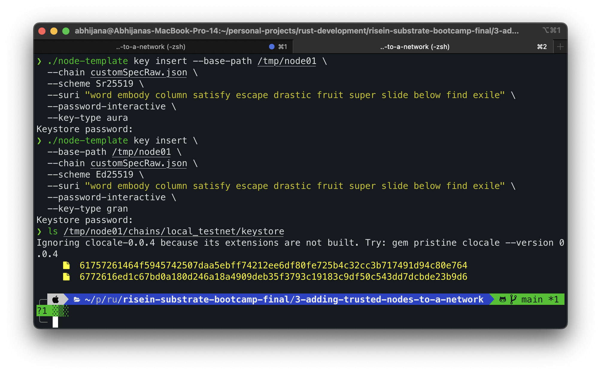
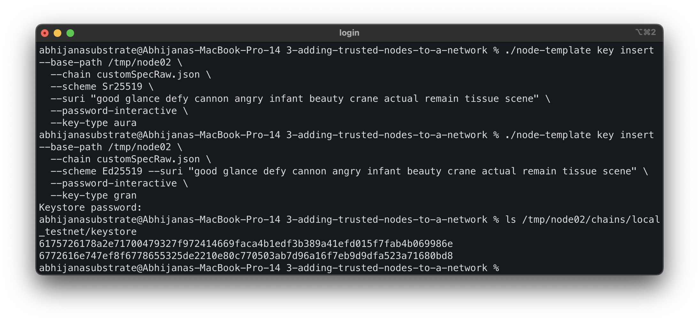
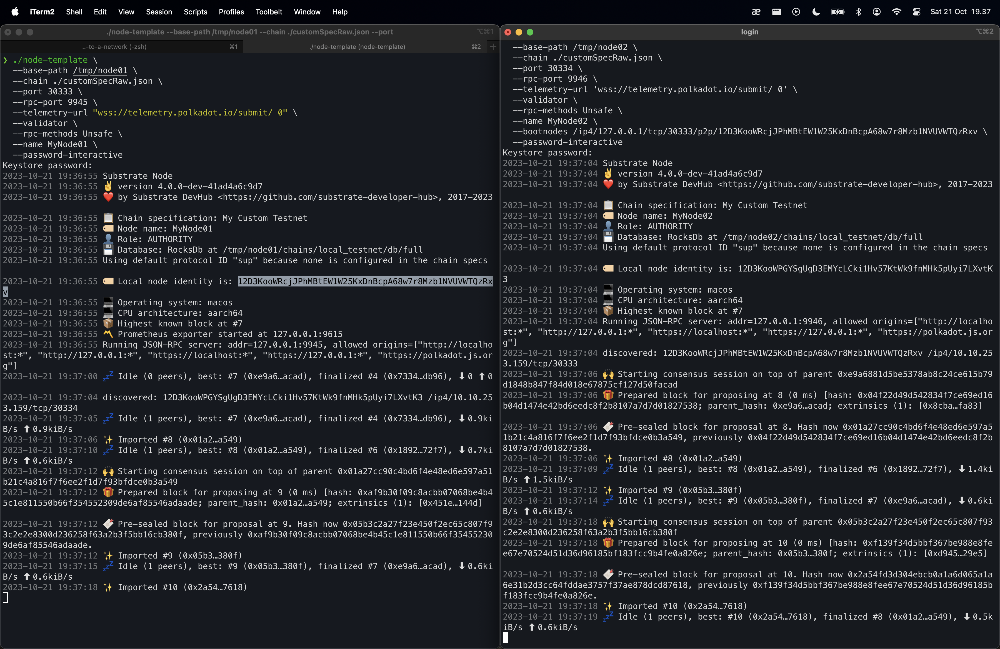

# Simulating a Substrate Network
In this third hands on project we will start a blockchain network with multiple authorized nodes. There is a compiled node included in this directory.

## Generating account and keys

We will generate our own secret keys for the validator nodes in the network. We do it by using node-template subcommand

### Aura keys

```bash
./node-template key generate --scheme Sr25519 --password-interactive
```

Enter a password for the generated keys, then we will get keys for producing blocks using `aura`:


### Grandpa keys

Replace the **{{secret_phrase}}** with the one that just generated

```bash
./node-template key inspect --password-interactive --scheme Ed25519 "{{secret_phrase}}"
```

Enter the password to generate the keys and we will get our `grandpa` keys:


## Create a custom chain specification

Let's create a custom chain spec using the created key pairs. Export the `local` chain spec to a file by executing:

```bash
./node-template build-spec --disable-default-bootnode --chain local > customSpec.json
```

Change the `name` field to identify the chain spec, the `aura` field (for creating blocks) and the `grandpa` field (for finalizing blocks)



## Convert the chain spec to raw format

To convert a chain spec to raw format run:

```bash
./node-template build-spec --chain=customSpec.json --raw --disable-default-bootnode > customSpecRaw.json
```

## Starting the first node (bootnode)

```bash
./node-template \
  --base-path /tmp/node01 \
  --chain ./customSpecRaw.json \
  --port 30333 \
  --rpc-port 9945 \
  --telemetry-url "wss://telemetry.polkadot.io/submit/ 0" \
  --validator \
  --rpc-methods Unsafe \
  --name MyNode01 \
  --password-interactive
```

When asked for a password, enter the same password that was used to generate the keys



## Add keys to the keystore

We will need to add `aura` and `grandpa` authority keys for each node




## Starting nodes

