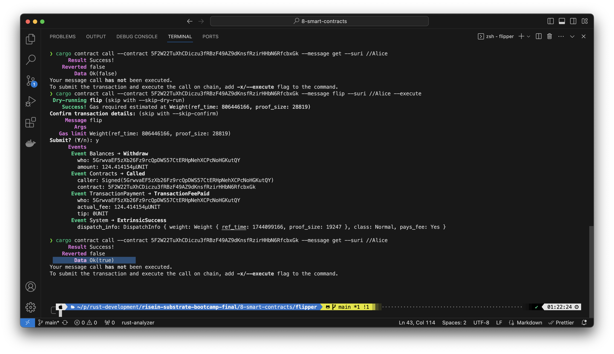

# Smart Contracts
In this eighth hands on project we will build a simple smart contract to run on a Substrate-based chain.

## Install the CLI tool

Ensure the `rust-src` and the WebAssembly target are installed. Then, install `cargo-contract` and `contracts-node `
```bash
cargo install --force --locked cargo-contract
```

```bash
cargo install contracts-node
```

## Create a new smart contract project
```bash
cargo contract new flipper
```
The command above will create a project called flipper. `cd` to it and build the contract by running:
```bash
cargo contract build
```


## Deploy contract

First, we need to start our node:

```bash
substrate-contracts-node --log info,runtime::contracts=debug 2>&1
```


Then instantiate our contract
```bash
cargo contract instantiate --constructor new --args "false" --suri //Alice --salt $(date +%s) --execute
```


From the screenshot above, our instantiated contract address is `5F2W22TuXhCDiczu3fRBzF49AZ9dKnsfRzirHHbN6RfcbxGk`

### Interact with contract


